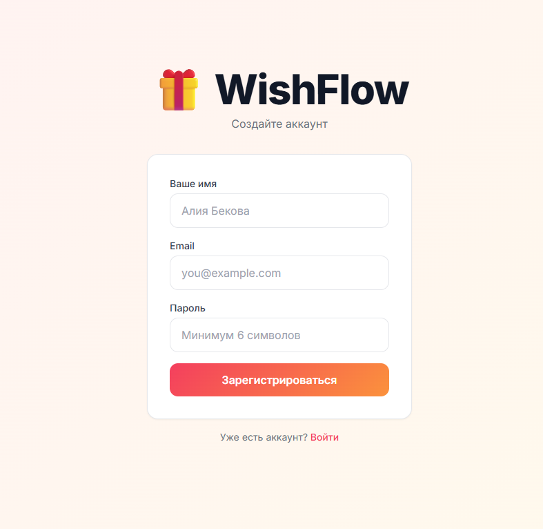

# WishFlow

> **Вишлист, который хранит сюрприз** — создай список желаний, поделись с друзьями. Они зарезервируют подарки, а ты не узнаешь кто что выбрал.

О проекте

**WishFlow** — это веб-приложение для создания и управления списками желаний. Идеально подходит для дней рождения, свадеб, новогодних праздников и любых других поводов.

Главная фишка: **друзья видят, кто уже зарезервировал подарок — а ты нет**. Сюрприз сохраняется!

---

## Возможности

- **Создание вишлистов** — для любого повода: день рождения, свадьба, новый год
- **Добавление желаний** — название, цена, ссылка на товар, картинка, описание и приоритет
- **Автозаполнение** — вставь ссылку с Ozon/Wildberries, и название подтянется автоматически
- **Приоритеты** — «Очень хочу», «Хочу», «Было бы неплохо»
- **Режим гостя** — друзья видят список и могут зарезервировать подарок
- **Защита сюрприза** — владелец не видит, кто что выбрал
- **Шаринг** — поделись вишлистом одной ссылкой
- **Реалтайм обновления** — через WebSocket

---

## 🛠 Стек технологий

**Frontend**
- [Next.js](https://nextjs.org/) + React
- TypeScript
- Tailwind CSS

**Backend**
- [FastAPI](https://fastapi.tiangolo.com/) (Python)
- PostgreSQL
- WebSocket (реалтайм)

**Инфраструктура**
- Docker / Docker Compose
- JWT аутентификация

---

## Скриншоты

| Главная страница | Регистрация | Мои вишлисты |
|:---:|:---:|:---:|
|  |  |  |

| Страница вишлиста | Добавление желания |
|:---:|:---:|
|  |  |

---
## ⚙️ Установка и запуск

### Требования

- Docker & Docker Compose
- Node.js 18+
- Python 3.10+

### Быстрый старт с Docker

```bash
# Клонируй репозиторий
git clone https://github.com/your-username/wishflow.git
cd wishflow

# Запусти через Docker Compose
docker-compose up --build
```
### Локальный запуск

**Backend:**
```bash
cd backend
pip install -r requirements.txt
uvicorn main:app --reload
```

**Frontend:**
```bash
cd frontend
npm install
npm run dev
```

---

## Структура проекта

```
wishflow/
├── frontend/          # Next.js приложение
│   ├── components/
│   ├── pages/
│   └── styles/
├── backend/           # FastAPI сервер
│   ├── routers/
│   ├── models/
│   └── main.py
├── docker-compose.yml
└── README.md
```
